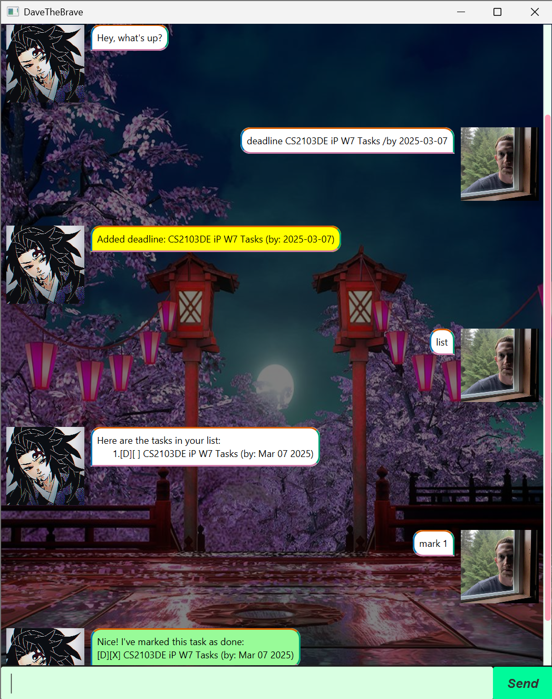

# DaveTheBrave User Guide

DaveTheBrave is a **desktop chatbot** for managing your tasks amidst your busy schedule, 
functioning as your very own personal assistant keeping track of all of your tasks anytime and anywhere.

## Quick Start
1. Ensure you have Java `17` or above installed in your Computer.
2. Download the latest .jar file from the [repository releases](https://github.com/Jen999/ip/releases).
3. Copy the file to the folder you want to use as the _home folder_ for DaveTheBrave. 
4. Open a command terminal, `cd` into the folder of your jar file, and use the `java -jar davethebrave.jar` command to run the application.
5. A GUI similar to the below should appear in a few seconds, and you can start chatting away about your tasks!

## Features

### View your tasks : `list`
View all your tasks in a list with a single command.
`list`

### Adding tasks : `todo / deadline / event`
There are 3 different types of tasks you can add:
- "todo": To-do task without any deadlines
`todo <TASK_NAME>`
- "deadline": Task with a deadline to be set
`deadline <TASK_NAME> /by <YYYY-MM-DD>`
- "event": Event task with a start and end date
`event <TASK_NAME> /start <DATE/TIME> /end <DATE/TIME>`

### Deleting tasks : `delete`
Tasks can be deleted by their index numbers.
`
// Delete first task (1.) of the list
delete 1
`

### Marking tasks as done : `mark`
All types of tasks can be marked by their index numbers when done.
`
// Mark fifth task (5.) as done
mark 5
`

### Unmarking tasks as not done : `unmark`
All types of tasks can be unmark by their index numbers.
`
// Unmark third task (3.) as undone
unmark 3
`

### Find tasks by keyword : `find`
Search for any tasks with a keyword.
`
// Find task with the 'exam' keyword
find exam
`

### Display deadline tasks chronologically
View all your urgent deadline tasks in chronological order.
`show deadline`

